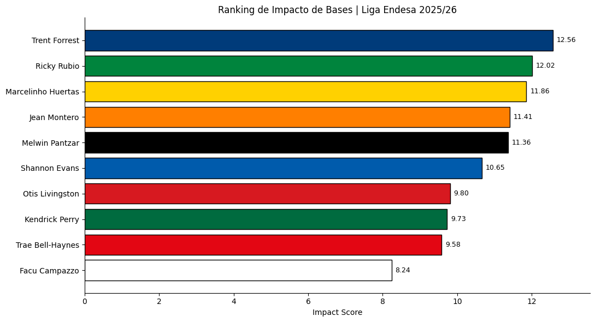

# ACB Point Guard Impact

## Project Overview

This project analyses the impact of a sample of point guards from Liga Endesa during the 2025/26 season.

The objective was to compare players using scoring, playmaking, defensive contribution and overall performance metrics through a custom indicator called Impact Score.

## Main Visualization

### Impact Score Ranking

## Tools Used

- Python
- Pandas
- Google Colab
- Microsoft Excel
- Matplotlib

## Objectives

- Compare point guard performance.
- Develop a custom impact metric.
- Analyse scoring, assists, steals and player rating.
- Visualise player impact through a ranking.

## Project Status

Completed.

## Author

Marcos Alonso Portela
